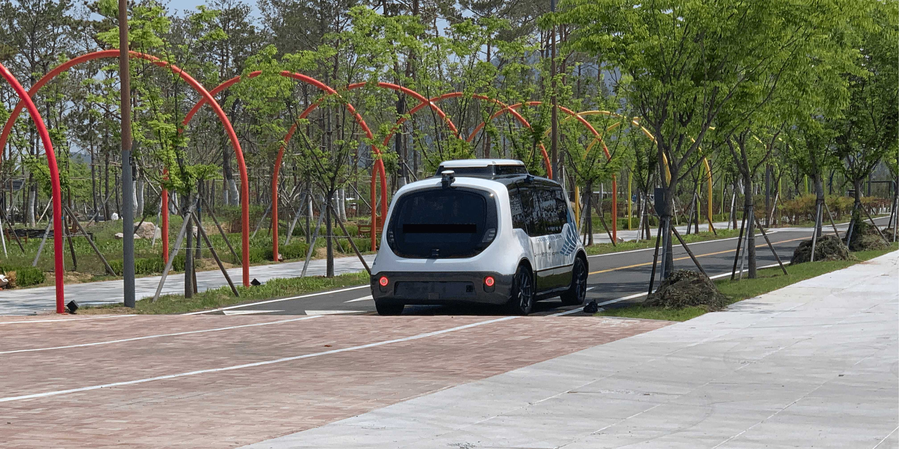

# vlp16-viewer

This directory can be used in an environment where ROS is not installed.

This code is specific to VLP-16, but it's very easy to adapt the code to HDL-32 or HDL-64E.

I have modified the velodyne driver supplied by the [this link](https://github.com/linbaiwpi/VLP16_driver_on_PYNQ) 

## How to use

### 1. vlp16_viewer

> Write down the -h option to see how to use it.

~~~shell
$ mkdir build && cd build
$ cmake ..
$ make
$ cd tests
$ ./ViewerTest or ./ViewerTest -pcap test.pcap
~~~

- socket example

~~~
$ ./ViewerTest
~~~

- pcap example

~~~shell
$ ./ViewerTest -pcap {pcap file path}
example >>> $ ./ViewerTest -pcap test.pcap
~~~

### 2. vlp16_cluster

This is an example of clustering with the same pcap file as the example above.

The picture below was taken at Sejong City Central Park. I got the vlp-16 pcap file from here.

<left></left>

- cluster example

~~~
$ mkdir build && cd build
$ cmake ..
$ make
$ cd tests
$ ./renderTest or ./renderTest -pcap test.pcap
~~~

## TODO

**[O]** make it compatible Socket or PCAP 

**[O]** Velodyne Viewer

**[O]** Clustering (make Box)

**[ - ]** MultiThreading 

